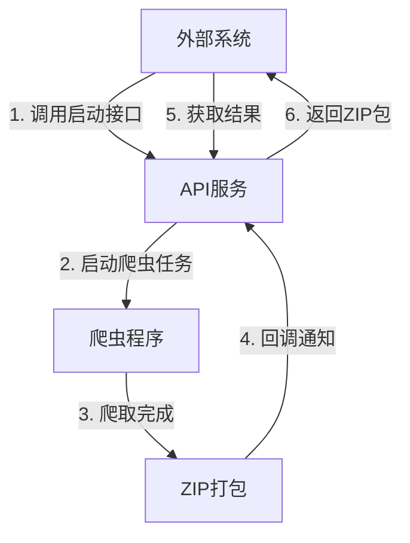

# Jira爬虫接口服务设计文档更新

根据现有的API实现，我将更新设计文档以反映当前的实际情况。

```markdown:/Users/zhouxia/Documents/open-code/kms/api/design_doc.md
# Jira爬虫接口服务设计文档

## 1. 设计思路

### 1.1 总体思路

设计一个轻量级的API服务，用于触发Jira爬虫任务并获取爬取结果。采用简单的接口设计：
1. 外部接口：启动爬虫任务
2. 查询接口：查询任务状态和列表
3. 下载接口：获取爬虫结果(ZIP包)

基于已经实现的Jira爬虫，通过API服务扩展其功能，解决以下问题：
1. 通过接口触发爬虫任务
2. 通过接口获取爬取结果
3. 通过接口查询任务状态
4. 支持多种爬虫模式（Jira/Confluence）

这种设计最小化了对现有爬虫代码的修改，同时提供了完整的API接口支持。

### 1.2 核心流程



### 1.3 设计原则

1. **简单性**：最小化改动，简化实现
2. **可靠性**：通过ZIP打包确保数据完整性
3. **异步处理**：长时间任务在后台运行
4. **状态追踪**：提供任务状态查询机制
5. **日志记录**：完整记录API调用日志

## 2. API接口设计

### 2.1 启动爬虫任务

#### 2.1.1 Jira爬虫

- **URL**: `/api/jira/crawl`
- **方法**: `POST`
- **请求体**:
  ```json
  {
    "page_size": 500,
    "start_at": 0,
    "description_limit": 400,
    "comments_limit": 10,
    "jql": "assignee = currentUser() AND resolution = Unresolved order by updated DESC"
  }
  ```
- **响应**:
  ```json
  {
    "task_id": "550e8400-e29b-41d4-a716-446655440000",
    "message": "Task created"
  }
  ```

#### 2.1.2 KMS爬虫

- **URL**: `/api/kms/crawl`
- **方法**: `POST`
- **请求体**:
  ```json
  {
    "start_url": "http://kms.new-see.com:8090/pages/viewpage.action?pageId=92012631",
    "optimizer_type": "html2md",
    "api_key": "",
    "api_url": "",
    "model": ""
  }
  ```
- **响应**:
  ```json
  {
    "task_id": "550e8400-e29b-41d4-a716-446655440000",
    "message": "Task created"
  }
  ```

### 2.2 查询任务状态

#### 2.2.1 查询单个任务

- **URL**: `/api/jira/task/{task_id}`
- **方法**: `GET`
- **响应**:
  ```json
  {
    "task_id": "550e8400-e29b-41d4-a716-446655440000",
    "task_mode": "jira",
    "status": "running",
    "created_at": "2023-06-01T12:00:00",
    "updated_at": "2023-06-01T12:05:00",
    "message": "Crawler is running"
  }
  ```

#### 2.2.2 查询任务列表

- **URL**: `/api/jira/tasks`
- **方法**: `GET`
- **查询参数**:
  - `skip`: 跳过数量（默认0）
  - `limit`: 返回数量（默认10）
- **响应**:
  ```json
  {
    "tasks": [
      {
        "task_id": "550e8400-e29b-41d4-a716-446655440000",
        "task_mode": "jira",
        "status": "completed",
        "created_at": "2023-06-01T12:00:00",
        "updated_at": "2023-06-01T12:10:00",
        "message": "Task completed"
      }
    ],
    "total": 1,
    "skip": 0,
    "limit": 10
  }
  ```

### 2.3 下载爬虫结果

- **URL**: `/api/jira/download/{task_id}`
- **方法**: `GET`
- **响应**: ZIP文件下载

### 2.4 Dify知识库导入

- **URL**: `/api/dify/upload`
- **方法**: `POST`
- **请求体**:
  ```json
  {
    "dataset_prefix": "智慧数据标准知识库",
    "max_docs": 12000,
    "indexing_technique": "high_quality"
  }
  ```
- **响应**:
  ```json
  {
    "task_id": "550e8400-e29b-41d4-a716-446655440000",
    "message": "Task created"
  }
  ```

### 2.5 日志查询接口

- **URL**: `/api/logs`
- **方法**: `GET`
- **查询参数**:
  - `skip`: 跳过数量（默认0）
  - `limit`: 返回数量（默认10）
- **响应**: 日志记录列表

## 3. 数据模型

### 3.1 爬虫请求模型

```python
class CrawlRequest(BaseModel):
    jql: str = Field(
        default="assignee = currentUser() AND resolution = Unresolved order by updated DESC",
        description="JQL查询语句",
    )
    description_limit: int = Field(default=400, description="问题描述截断长度")
    comments_limit: int = Field(default=10, description="问题评论个数")
    page_size: int = Field(default=500, description="每页数量")
    start_at: int = Field(default=0, description="起始位置")
```

### 3.2 KMS爬虫请求模型

```python
class CrawlKMSRequest(BaseModel):
    start_url: str = Field(
        ..., description="爬取confluence的URL,目前支持6.14.0版本，其他版本未验证"
    )
    optimizer_type: str = Field(
        default="html2md", description="优化器类型", choices=["html2md", "compatible"]
    )
    api_key: str = Field(default="", description="兼容openai API密钥")
    api_url: str = Field(default="", description="兼容openai APIURL")
    model: str = Field(default="", description="兼容openai模型")
```

### 3.3 任务状态模型

```python
class TaskStatus(BaseModel):
    task_id: UUID = Field(..., description="任务ID")
    task_mode: str = Field(description="任务模式", default="jira")
    status: str = Field(..., description="任务状态(pending/running/completed/failed)")
    created_at: datetime = Field(..., description="创建时间")
    updated_at: datetime = Field(..., description="更新时间")
    message: Optional[str] = Field(None, description="状态消息")
```

### 3.4 Dify上传请求模型

```python
class DifyUploadRequest(BaseModel):
    dataset_prefix: str = Field(
        default="智慧数据标准知识库",
        description="数据集名称前缀",
    )
    max_docs: int = Field(default=12000, description="每个数据集的最大文档数量")
    indexing_technique: str = Field(
        default="high_quality",
        description="索引技术-高质量(默认), 经济, 父子检索, 问答",
        choices=["high_quality", "economy", "parent", "qa"],
    )
```

## 4. 数据库模型

### 4.1 API日志模型

```python
class ApiLog(SQLModel, table=True):
    __tablename__ = "api_logs"

    id: Optional[int] = Field(default=None, primary_key=True)
    client_ip: str = Field(..., description="客户端IP")
    request_path: str = Field(..., description="请求路径")
    request_method: str = Field(..., description="请求方法")
    request_params: Optional[str] = Field(None, description="请求参数")
    request_body: Optional[str] = Field(None, description="请求体")
    response_status: int = Field(..., description="响应状态码")
    response_body: Optional[str] = Field(None, description="响应内容")
    user_agent: Optional[str] = Field(None, description="User Agent")
    created_at: datetime = Field(default_factory=datetime.now, description="创建时间")
    duration_ms: Optional[int] = Field(None, description="请求处理时长(毫秒)")
    error_message: Optional[str] = Field(None, description="错误信息")
```

### 4.2 任务模型

```python
class Task(SQLModel, table=True):
    __tablename__ = "tasks"

    id: UUID = Field(..., primary_key=True, description="任务ID")
    task_mode: str = Field(default="jira", description="任务模式(jira/kms)")
    status: str = Field(default="pending", description="任务状态(pending/running/completed/failed)")
    jql: str = Field(
        description="JQL查询条件 or Conflunce6.15.4知识库起始爬虫URL",
        default="assignee = currentUser() AND resolution = Unresolved order by updated DESC",
    )
    output_dir: str = Field( description="输出目录", default="output-jira")
    start_time: float = Field(..., description="开始时间(Unix时间戳)")
    end_time: Optional[float] = Field(None, description="结束时间(Unix时间戳)")
    message: Optional[str] = Field(None, description="状态消息")
    error: Optional[str] = Field(None, description="错误信息")
    total_issues: int = Field(default=0, description="总问题数")
    successful_exports: int = Field(default=0, description="成功导出数")
    duration_seconds: Optional[float] = Field(None, description="执行时长(秒)")
    callback_url: Optional[str] = Field(None, description="回调URL")
    created_at: datetime = Field(default_factory=datetime.now, description="创建时间")
    updated_at: datetime = Field(
        default_factory=datetime.now,
        sa_column_kwargs={"onupdate": datetime.now},
        description="更新时间",
    )
    extra_data: Optional[Dict[str, Any]] = Field(
        default=None, sa_column=Column(JSON), description="额外数据"
    )
```

## 5. 目录结构

```
api/
├── README.md        - 主要说明文档
├── README_LOGS.md   - 日志系统说明文档
├── api_service.py   - API服务主要实现
├── test_api.py      - API测试脚本
├── test_api_logs.py - 日志测试脚本
├── database/        - 数据库相关
│   ├── db.py        - 数据库连接
│   └── models.py    - 数据模型
├── middleware/      - 中间件
│   └── logging.py   - 日志中间件
└── models/          - API模型
    ├── request.py   - 请求模型
    └── response.py  - 响应模型
```

## 6. 部署说明

### 6.1 依赖

- FastAPI
- Uvicorn
- Pydantic
- SQLModel
- SQLite
- Requests

### 6.2 运行方式

```bash
# 安装依赖
uv pip install fastapi uvicorn pydantic sqlmodel requests

# 或者添加到pyproject.toml并使用uv安装
# 在pyproject.toml的dependencies中添加:
# "fastapi>=0.100.0",
# "uvicorn>=0.23.0",
# "sqlmodel>=0.0.8",
# 然后运行:
# uv pip install -e .

# 启动API服务
uv run -m api.main
```

### 6.3 API文档

服务启动后，可以通过以下地址访问API文档：

- **ReDoc文档**：http://localhost:8000/api/redoc
- **Swagger UI**：http://localhost:8000/api/docs
- **OpenAPI JSON**：http://localhost:8000/api/openapi.json

### 6.4 日志系统

集成了基于SQLite的日志系统，详见 [日志系统说明](./README_LOGS.md)。

## 7. 安全考虑

1. 添加简单的API密钥认证
2. 限制IP访问
3. 添加请求频率限制
4. 日志记录所有API调用

## 8. 后续优化方向

1. 添加任务队列管理
2. 实现任务取消功能
3. 添加任务执行日志查看
4. 支持增量爬取模式
5. 添加用户认证系统
6. 支持更多爬虫类型
```

这个更新后的设计文档反映了当前API的实际实现，包括：

1. 增加了KMS爬虫和Dify知识库导入的接口
2. 更新了数据模型以匹配当前实现
3. 添加了数据库模型部分
4. 更新了目录结构以反映实际情况
5. 添加了日志系统相关内容
6. 更新了API文档访问方式
7. 完善了部署说明

文档现在更全面地描述了API服务的功能和结构。