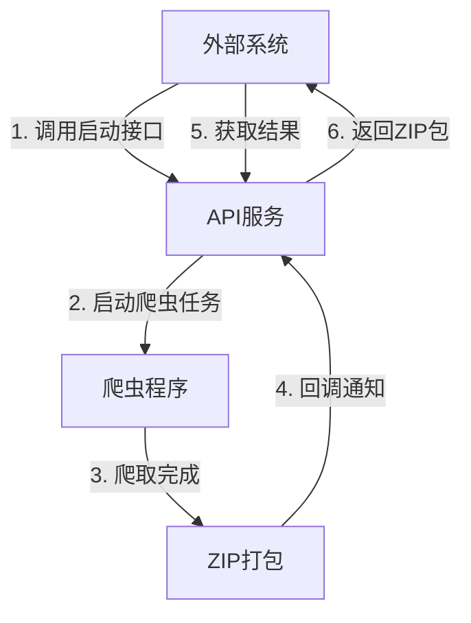

# KMS-Scrapy Jira爬虫接口服务设计文档

## 1. 设计思路

### 1.1 总体思路

设计一个轻量级的API服务，用于触发Jira爬虫任务并获取爬取结果。采用简单的三接口设计：
1. 外部接口：启动爬虫任务
2. 内部接口1：查询任务状态
3. 内部接口2：获取爬虫结果(ZIP包)

这种设计最小化了对现有爬虫代码的修改，只需在爬虫入口添加命令行参数支持和回调功能。

### 1.2 核心流程



### 1.3 设计原则

1. **简单性**：最小化改动，简化实现
2. **可靠性**：通过ZIP打包确保数据完整性
3. **异步处理**：长时间任务在后台运行
4. **状态追踪**：提供任务状态查询机制

## 2. API接口设计

### 2.1 启动爬虫任务

- **URL**: `/api/jira/crawl`
- **方法**: `POST`
- **请求体**:
  ```json
  {
    "page_size": 50,
    "start_at": 0,
    "jql": "project = DEMO"
  }
  ```
- **响应**:
  ```json
  {
    "task_id": "550e8400-e29b-41d4-a716-446655440000",
    "status": "pending",
    "start_time": 1614402123.45,
    "end_time": null,
    "message": "Task created"
  }
  ```

### 2.2 查询任务状态

- **URL**: `/api/jira/task/{task_id}`
- **方法**: `GET`
- **响应**:
  ```json
  {
    "task_id": "550e8400-e29b-41d4-a716-446655440000",
    "status": "running",
    "start_time": 1614402123.45,
    "end_time": null,
    "message": "Crawler is running"
  }
  ```

### 2.3 下载爬虫结果

- **URL**: `/api/jira/download/{task_id}`
- **方法**: `GET`
- **响应**: ZIP文件下载

### 2.4 爬虫回调接口(内部使用)

- **URL**: `/api/jira/callback/{task_id}`
- **方法**: `POST`
- **响应**:
  ```json
  {
    "status": "received"
  }
  ```

## 3. 数据模型

### 3.1 爬虫请求模型

```python
class CrawlRequest(BaseModel):
    page_size: int = 50
    start_at: int = 0
    jql: str = ""
```

### 3.2 任务状态模型

```python
class TaskStatus(BaseModel):
    task_id: str
    status: str  # "pending", "running", "completed", "failed"
    start_time: float
    end_time: Optional[float] = None
    message: Optional[str] = None
```

## 4. 爬虫改造

### 4.1 命令行参数支持

为爬虫入口添加命令行参数支持，包括：
- `--page_size`: 页面大小
- `--start_at`: 起始位置
- `--jql`: JQL查询语句
- `--output_dir`: 输出目录
- `--callback_url`: 回调URL

### 4.2 回调功能

爬虫完成后，调用回调URL通知API服务。

## 5. 实现计划

### 5.1 API服务实现

1. 创建FastAPI应用
2. 实现三个主要接口
3. 添加任务状态管理
4. 实现ZIP打包功能

### 5.2 爬虫改造

1. 修改`jira/main.py`，添加命令行参数支持
2. 添加回调功能

### 5.3 目录结构

```
api/
├── api_service.py    # API服务实现
├── design_doc.md     # 设计文档
└── models/           # 数据模型
    ├── request.py    # 请求模型
    └── response.py   # 响应模型
```

## 6. 部署考虑

### 6.1 依赖

- FastAPI
- Uvicorn
- Pydantic
- Requests

### 6.2 运行方式

```bash
# 安装依赖
uv pip install fastapi uvicorn pydantic requests

# 或者添加到pyproject.toml并使用uv安装
# 在pyproject.toml的dependencies中添加:
# "fastapi>=0.100.0",
# "uvicorn>=0.23.0",
# 然后运行:
# uv pip install -e .

# 启动API服务
uv run -m api.api_service
```

### 6.3 临时文件管理

定期清理`temp`目录中的旧任务数据，避免磁盘空间占用过大。

## 7. 前端集成建议

1. 调用启动接口获取task_id
2. 每隔几秒调用状态查询接口
3. 当状态变为"completed"时，显示下载按钮
4. 用户点击下载按钮，调用下载接口获取ZIP包
5. 在等待过程中显示友好的进度提示

## 8. 安全考虑

1. 添加简单的API密钥认证
2. 限制IP访问
3. 添加请求频率限制

## 9. 后续优化方向

1. 添加任务队列管理
2. 实现任务取消功能
3. 添加任务执行日志查看
4. 支持增量爬取模式
