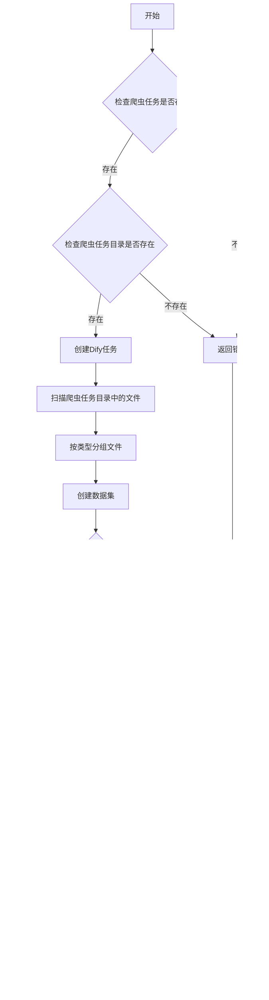

# Dify 知识库导入 API 工作流程

## 任务创建与执行流程


## 任务状态流转图


## 系统组件关系图

```mermaid
graph TD
    A[客户端] -->|请求| B[FastAPI 应用]
    B -->|读写| C[SQLModel 数据库]
    B -->|异步调用| D[任务处理器]
    D -->|执行| E[Dify 主程序]
    E -->|调用| F[Dify API]
    D -->|更新| C
    B -->|响应| A
    
    subgraph 数据模型
        C1[Task]
        C2[DifyTask]
        C3[DifyUploadRequest]
        C4[DifyTaskStatus]
    end
    
    subgraph API 路由
        B1[/api/dify/upload/{crawler_task_id}]
        B2[/api/dify/task/{task_id}]
        B3[/api/dify/tasks]
        B4[/api/dify/task/{task_id} DELETE]
    end
    
    C -.-> C1
    C -.-> C2
    C -.-> C3
    C -.-> C4
    
    B -.-> B1
    B -.-> B2
    B -.-> B3
    B -.-> B4
    
    C1 -->|关联| C2
```

## 文件处理流程



## 任务关联关系

```mermaid
graph LR
    A[爬虫任务 Task] -->|产生| B[输出目录]
    B -->|作为输入| C[Dify导入任务]
    C -->|记录关联| D[extra_data.crawler_task_id]
    C -->|使用| E[Dify API]
    E -->|创建| F[Dify知识库数据集]
