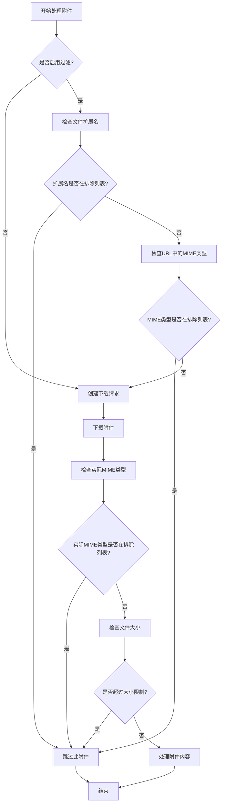

# 附件过滤流程

下面的流程图展示了附件过滤功能的工作流程：



## 配置说明

在 `crawler/core/config.py` 中的 `SpiderConfig` 类中，可以通过 `attachment_filters` 配置项来自定义附件过滤规则：

```python
attachment_filters: Dict[str, Any] = {
    # 排除的MIME类型列表
    "excluded_mime_types": ["image/jpeg", "image/png", "image/gif", "image/svg+xml"],
    # 排除的文件扩展名列表
    "excluded_extensions": [".jpg", ".jpeg", ".png", ".gif", ".svg"],
    # 最大附件大小(MB)，超过此大小的附件将被跳过
    "max_size_mb": 50,
    # 是否启用附件过滤
    "enabled": True,
}
```

## 过滤逻辑

1. **预过滤**：在下载前，根据文件扩展名和URL中的MIME类型提示进行初步过滤
2. **后过滤**：在下载后，根据实际的MIME类型和文件大小进行进一步过滤
3. **日志记录**：所有被过滤的附件都会在日志中记录，包括过滤原因
