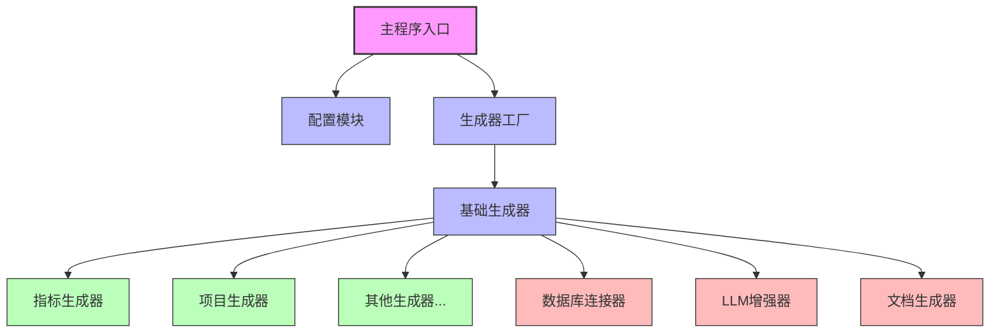
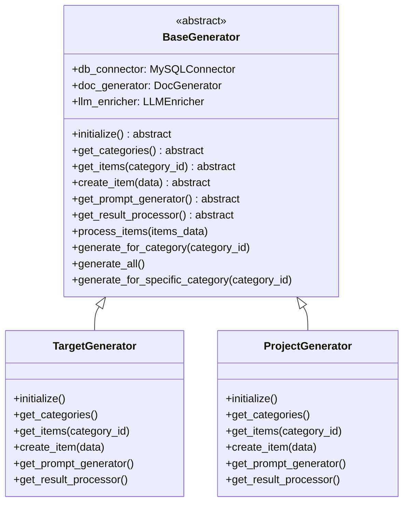
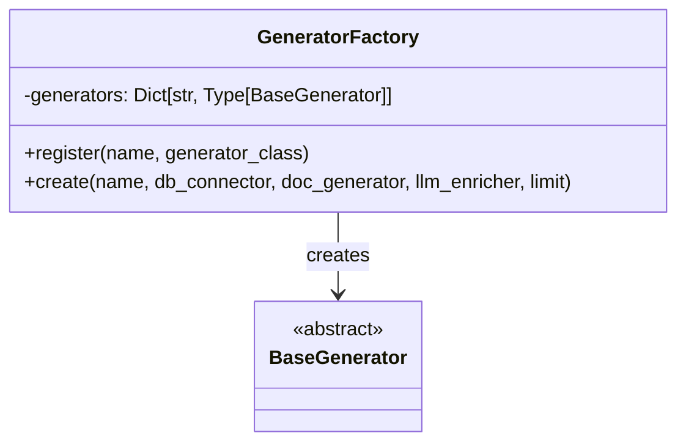
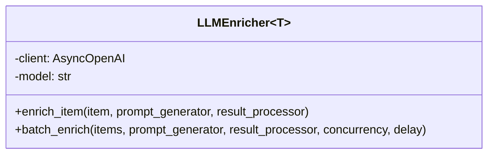
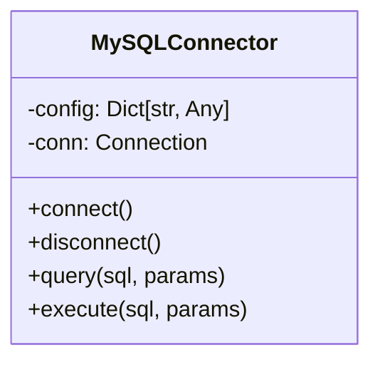
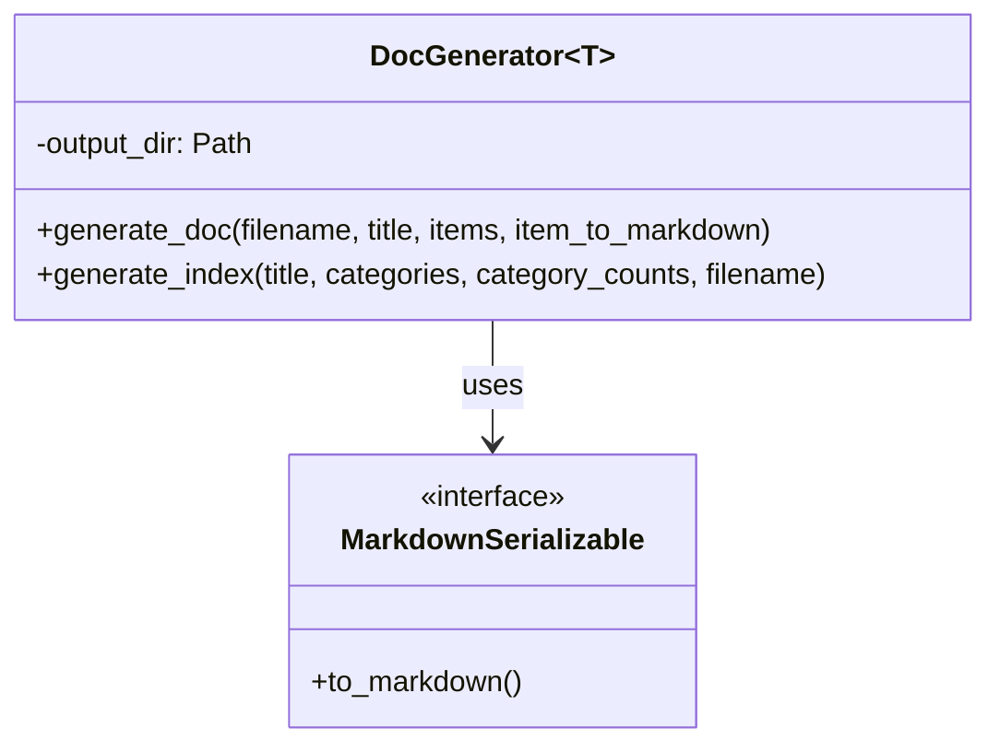
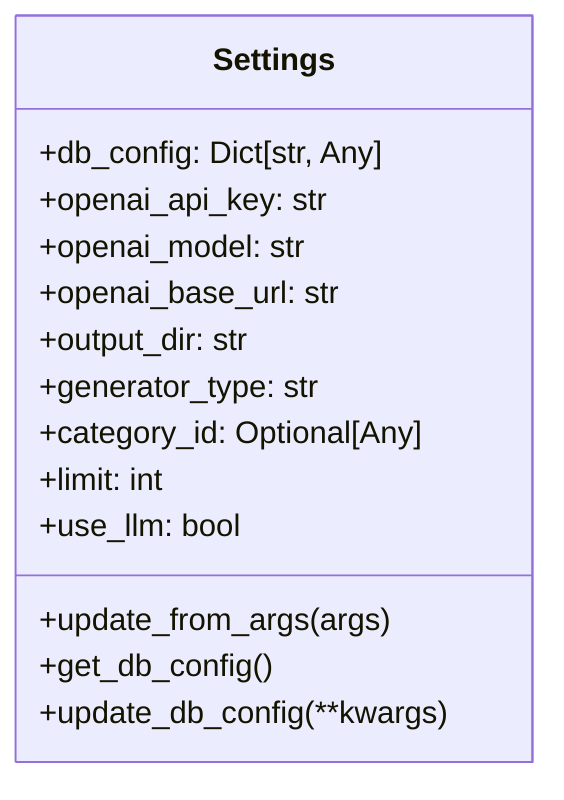
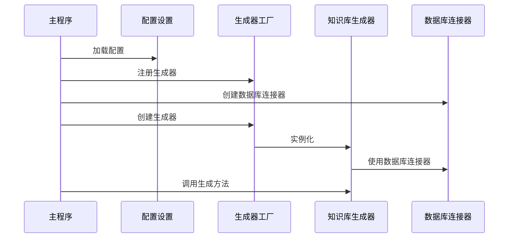
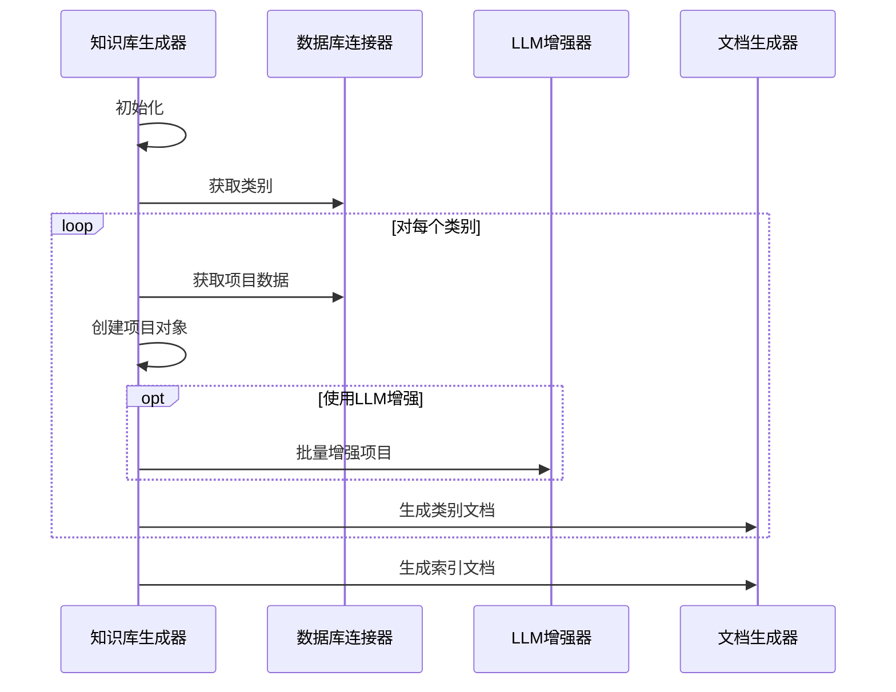
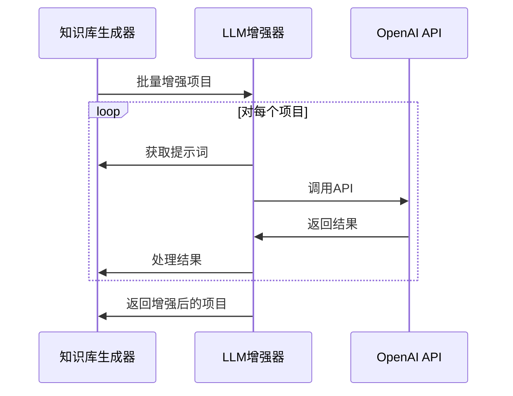

# 知识库生成工具架构设计思路解析

## 1. 设计目标

知识库生成工具的架构设计基于以下核心目标：

1. **高度模块化**：将不同功能拆分为独立模块，降低耦合度
2. **可扩展性**：支持轻松添加新的知识库类型，无需修改核心代码
3. **可配置性**：提供灵活的配置选项，适应不同场景需求
4. **可维护性**：清晰的代码结构和职责分离，便于后续维护和升级

## 2. 架构概览

### 2.1 整体架构图



### 2.2 目录结构

```
tools/gen-target/
├── __main__.py          # 主程序入口
├── config/              # 配置模块
│   ├── __init__.py
│   └── settings.py      # 配置设置
├── core/                # 核心组件
│   ├── __init__.py
│   ├── base_generator.py    # 生成器基类
│   ├── db.py                # 数据库连接器
│   ├── doc_generator.py     # 文档生成器
│   ├── generator_factory.py # 生成器工厂
│   └── llm.py               # LLM增强器
└── generators/          # 具体生成器实现
    ├── __init__.py
    ├── target_generator.py  # 指标生成器
    └── project_generator.py # 项目生成器(示例)
```

## 3. 核心组件详解

### 3.1 生成器基类 (BaseGenerator)

生成器基类定义了知识库生成的通用接口和流程，采用了**模板方法模式**，将通用流程固定，而将特定步骤留给子类实现。



关键设计点：
- 使用泛型参数`T`和`C`，分别表示数据项类型和类别ID类型
- 定义抽象方法，强制子类实现特定逻辑
- 提供通用方法，处理共同的流程

### 3.2 生成器工厂 (GeneratorFactory)

生成器工厂负责创建不同类型的生成器实例，采用**工厂模式**，隐藏了生成器的创建细节。



关键设计点：
- 支持动态注册生成器类
- 支持通过名称创建生成器实例
- 支持动态导入未注册的生成器

### 3.3 LLM增强器 (LLMEnricher)

LLM增强器负责使用大语言模型丰富知识库内容，采用**策略模式**，允许灵活配置提示词生成和结果处理策略。



关键设计点：
- 使用泛型参数`T`，支持不同类型的数据项
- 接受策略函数作为参数，实现灵活的提示词生成和结果处理
- 支持批量处理和并发控制

### 3.4 数据库连接器 (MySQLConnector)

数据库连接器封装了数据库操作，提供统一的接口，遵循**单一职责原则**。



关键设计点：
- 封装数据库连接和查询逻辑
- 提供错误处理和日志记录
- 支持参数化查询，防止SQL注入

### 3.5 文档生成器 (DocGenerator)

文档生成器负责生成知识库文档，采用**组合模式**，支持不同类型的文档生成。



关键设计点：
- 使用泛型参数`T`，支持不同类型的数据项
- 定义`MarkdownSerializable`协议，规范数据项的Markdown序列化
- 支持自定义序列化函数，增强灵活性

### 3.6 配置设置 (Settings)

配置设置负责管理全局配置，采用**单例模式**，确保全局唯一的配置实例。



关键设计点：
- 从环境变量和命令行参数加载配置
- 提供默认值和类型转换
- 支持运行时更新配置

## 4. 数据流程分析

### 4.1 初始化流程



### 4.2 知识库生成流程



### 4.3 LLM增强流程



## 5. 设计模式应用

本架构应用了多种设计模式，以提高代码的可维护性和可扩展性：

1. **模板方法模式**：`BaseGenerator`定义了算法骨架，而将一些步骤的实现延迟到子类
2. **工厂模式**：`GeneratorFactory`负责创建不同类型的生成器实例
3. **策略模式**：`LLMEnricher`接受不同的提示词生成和结果处理策略
4. **单例模式**：`Settings`确保全局唯一的配置实例
5. **组合模式**：`DocGenerator`支持不同类型的文档生成
6. **适配器模式**：各生成器适配不同的数据源和处理逻辑

## 6. 扩展性分析

### 6.1 添加新的知识库类型

添加新的知识库类型只需三步：

1. 创建新的数据模型类（如`ProjectItem`）
2. 创建新的生成器类（如`ProjectGenerator`），继承`BaseGenerator`
3. 在`register_generators`函数中注册新的生成器

无需修改任何核心代码，体现了**开闭原则**。

### 6.2 修改数据库类型

如果需要支持其他类型的数据库：

1. 创建新的数据库连接器类（如`PostgreSQLConnector`）
2. 实现与`MySQLConnector`相同的接口
3. 在创建生成器时使用新的连接器

### 6.3 替换LLM服务

如果需要使用其他LLM服务：

1. 修改`LLMEnricher`类或创建新的增强器类
2. 实现相同的接口
3. 在创建生成器时使用新的增强器

## 7. 性能优化考虑

### 7.1 数据库查询优化

- 使用分页查询处理大量数据
- 添加适当的索引提高查询效率
- 考虑使用缓存减少重复查询

### 7.2 LLM调用优化

- 使用并发控制平衡性能和API限制
- 实现重试机制处理临时错误
- 考虑本地缓存减少重复调用

### 7.3 文档生成优化

- 对于大型文档，考虑分块生成
- 使用异步IO提高文件操作效率

## 8. 未来扩展方向

### 8.1 功能扩展

- 支持更多知识库类型（项目、客户、产品等）
- 添加知识库搜索和查询功能
- 实现知识库版本控制和差异比较

### 8.2 技术扩展

- 支持更多数据库类型（PostgreSQL、MongoDB等）
- 支持更多LLM服务（Claude、Gemini等）
- 添加Web界面，提供可视化操作

### 8.3 集成扩展

- 与其他系统集成（如CMS、Wiki等）
- 支持自动化定时更新
- 添加通知机制，提醒知识库更新

## 9. 总结

知识库生成工具的架构设计遵循了软件工程的核心原则：

1. **SOLID原则**：单一职责、开闭原则、里氏替换、接口隔离、依赖倒置
2. **DRY原则**：不重复自己，抽象共同逻辑
3. **KISS原则**：保持简单，避免过度设计

通过模块化设计和清晰的接口定义，实现了高度可扩展和可维护的系统架构，为未来的功能扩展和技术升级提供了坚实基础。
