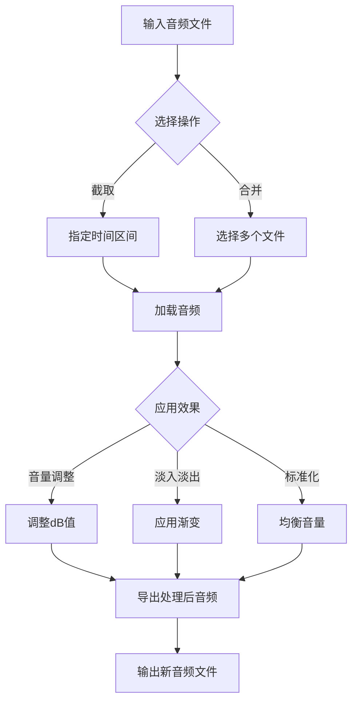

# 音频处理工具集

这个目录包含用于处理音频文件的Python工具，特别是支持m4a格式的音频截取、合并和其他处理功能。

## 工具列表

1. **audio_trimmer.py** - 基础音频截取工具
   - 支持m4a格式
   - 按毫秒指定截取区间
   - 跨平台支持（包括Windows长路径处理）

2. **audio_processor.py** - 高级音频处理工具
   - 支持多种格式（m4a, mp3, wav, ogg, flac等）
   - 多种时间格式输入（毫秒、MM:SS、HH:MM:SS）
   - 功能：截取、音量调整、格式转换、淡入淡出、音频合并

## 依赖安装

这些工具依赖于以下Python库：

```bash
pip install pydub
```

注意：pydub依赖于FFmpeg来处理大多数音频格式。请确保在系统上安装了FFmpeg：

### Windows

1. 下载FFmpeg: https://ffmpeg.org/download.html#build-windows
2. 解压到任意目录
3. 将FFmpeg的bin目录添加到系统PATH环境变量

或者使用Chocolatey安装:

```bash
choco install ffmpeg
```

### macOS

使用Homebrew安装:

```bash
brew install ffmpeg
```

### Linux

使用包管理器安装:

```bash
# Debian/Ubuntu
sudo apt-get install ffmpeg

# Fedora
sudo dnf install ffmpeg

# Arch Linux
sudo pacman -S ffmpeg
```

## 使用示例

### 基础音频截取

```bash
# 截取从30秒到60秒的部分
python audio_trimmer.py input.m4a output.m4a 30000 60000
```

### 高级音频处理

```bash
# 截取音频的30秒到1分钟区间
python audio_processor.py trim input.m4a output.m4a --start 30000 --end 60000

# 使用时分秒格式截取音频
python audio_processor.py trim input.m4a output.m4a --start 0:30 --end 1:00

# 调整音量并添加淡入淡出效果
python audio_processor.py trim input.m4a output.m4a --start 0:30 --end 1:00 --volume 3 --fade-in 1000 --fade-out 2000

# 合并多个音频文件
python audio_processor.py merge output.m4a input1.m4a input2.m4a input3.m4a --crossfade 500
```

## 功能流程图



## 注意事项

1. 在Windows系统上，这些工具已经处理了长路径问题，可以安全地处理深层目录中的文件
2. 时间可以用多种格式指定：毫秒数值、MM:SS或HH:MM:SS格式
3. 处理大文件时可能需要较多内存
